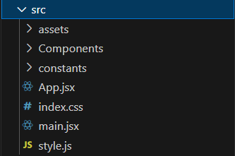
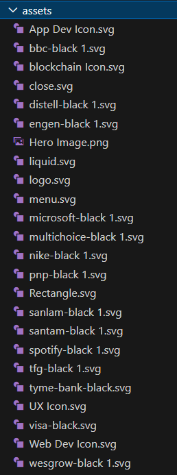
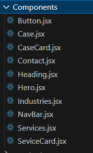
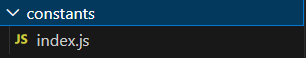
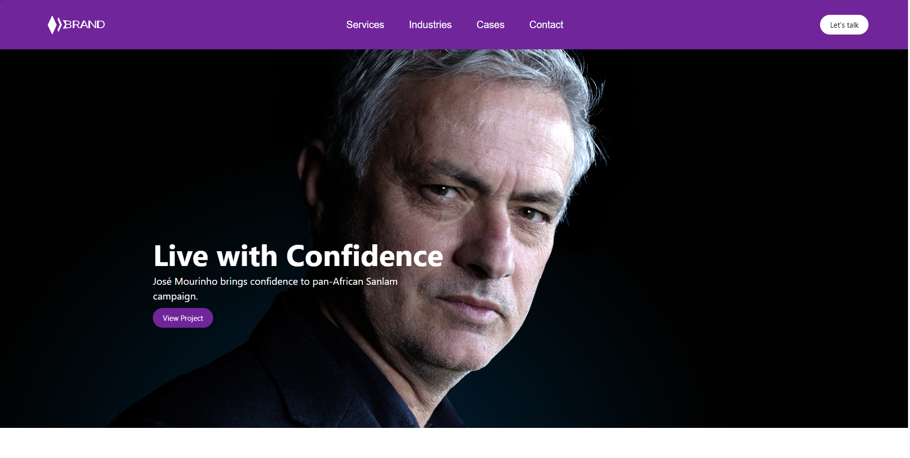

This project is a responsive website that was created using React and Tailwind CSS.

You will need:
1.  NodeJS -> If not already downloaded, download from https://nodejs.org/en

How to run application:

1. Download the application
2. Open it using Visual Studio Code 
3. Open the terminal
5. run -> npm install
6. run -> npm run dev in the terminal
7. Then proceed to open the application on your localhost. 

Project Structure:

The main folder for the application is the src folder.

Assets Folder:
This folder has all the required assets used for this project. All the png's and svg's are stored here.

Components Folder:
All the various Components used in this application are stored and edited in this folder.

Constants:
This folder involves one JavaScript file which is responsible for storing all the constants variables for this project such as the headings in the navigation bar etc. 

App.jsx:
This is the main jsx file that is run initially when the application is first rendered.

index.css:
This has the css for the index.html file

style.js:
This is used to define some styling techniques that I used.

How the project looks:

  

